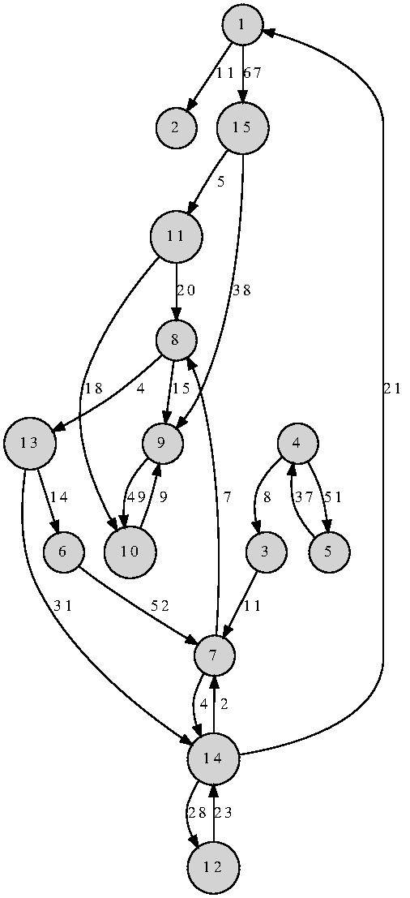
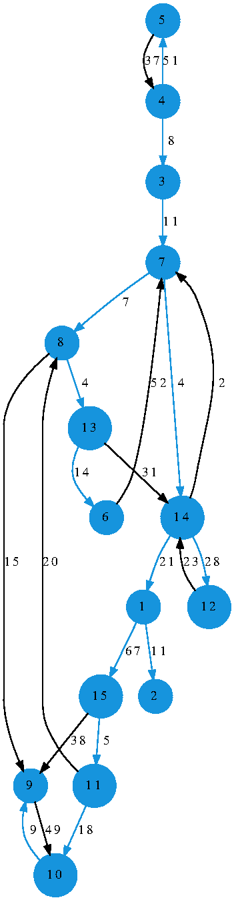
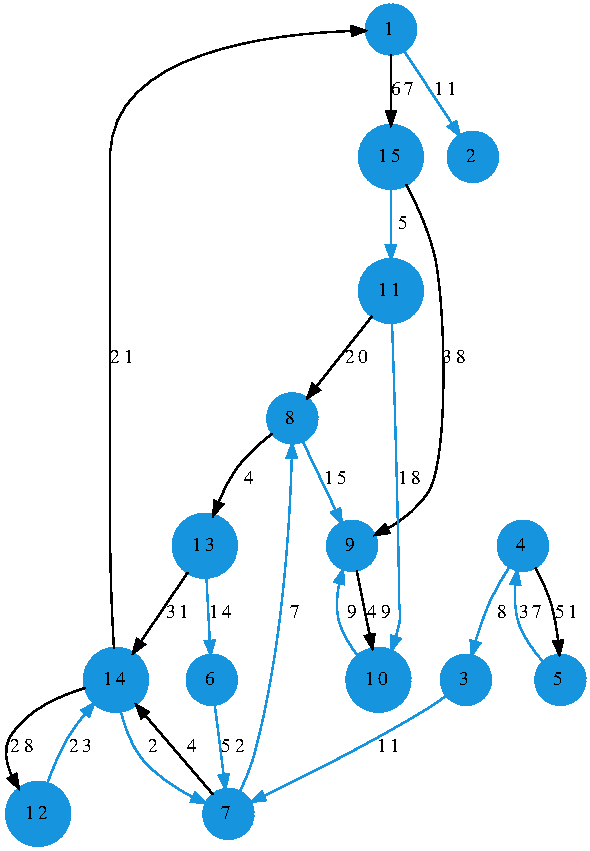
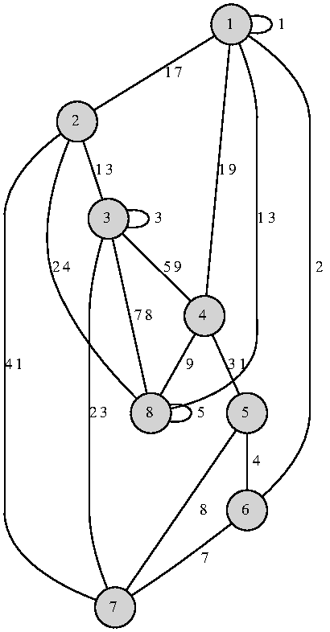
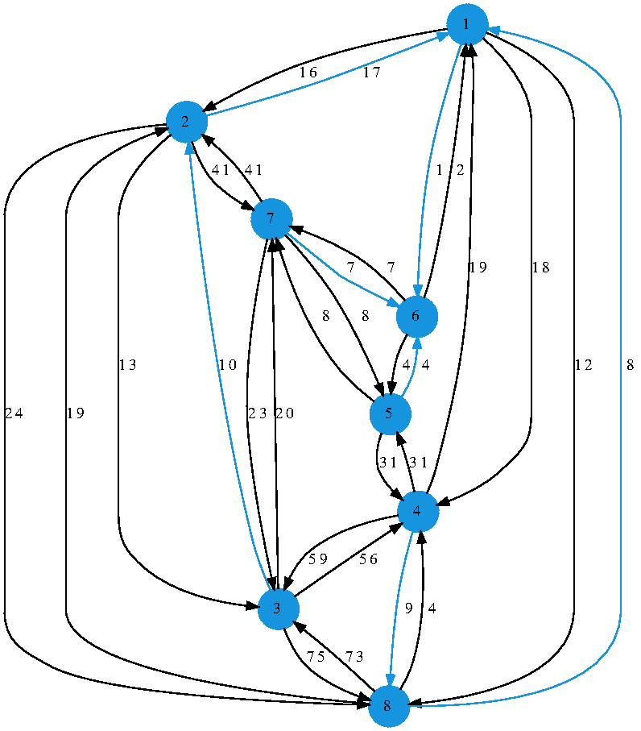
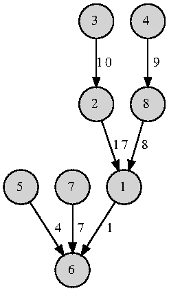

# mst_searching
The algorithm searches a minimum spanning tree (MST) and a minimum spanning forest (MSF) (also known as an optimum branching or a minimum-cost arborescence) in directed graphs by means of Chu-Liu/Edmonds algorithm.

By means of this program you can do the following:
1. Searching the minimum spanning tree in the directed graph
2. Searching the minimum forest in the one
3. Separately it handles the case of the potential graph


Prerequisites 
=============

To generate picture of the minimum spanning tree and forest you should have installed [graphviz](https://graphviz.org/)


How to build
============

1. create folder for binary files, e.g., `build`

    `mkdir build`

2. `cd build`

3. `cmake ..`

4. `make`

After this step you are ready to go!


How to use
==========

1. Navigate to you build directory (`build` in out example)

2. Run program by typing in `./run.exe`. After that you should see the following:

```
Output is written to ../output/YYYYMMDD_HHMMSS/
-- Which file from input/ should I take?
```


Program will automatically create output folder in `output/` directory named in the following format `YYYYMMDD_HHMMSS` where `YYYYMMDD` is the execution date and `HHMMSS` is the corresponding time.

__Note__: Output pictures are in .eps format

After that program will be waiting for you to provide file containing graph description as adjacency matrix with some additional information:

```
# of nodes
[adjacency matrix]
idx of the root node
```

Note: at the moment this is important that the file provided is in `input` directory of the project root directory

3. After that program will ask for number of connected components for minimum spanning forest
```
 -- k = ?
```

4. Program will automatically determine if the graph provided could be used as potential graph, if it is the case then you will see the following:
```
 -- Built for potential graph!
```

Otherwise, you will be asked whether or not the program to build minimum spanning tree:
```
 -- Built for non-potential graph!
 -- Should I build MST?
```

And if you wish to build minimum spanning forest:
```
 -- Should I build forest?
```


Examples
========

1. Directed graph

Original graph  



MST (Blue edges are in tree)



MSF for `k = 2` (Blue edges are in forest)



Also in structured view


2. Potential graph

Original non-oriented potential graph  



MST for the corresponding oriented graph (Blue edges are in tree), i.e., 
 
where  is the set of weights of the oriented graph and  is the set of weights of the original potential non-oriented graph



Also in structured view


